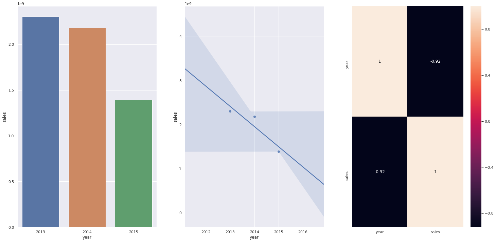

# Vendas Rossmann
Previsões de Vendas para Rede de Farmácias Rossmann

Este é um projeto de aprendizado de máquina de previsão de vendas.  
Os dados utilizados estão disponíveis na plataforma do [Kaggle](https://www.kaggle.com/c/rossmann-store-sales).  

**Acesse o código do projeto** [aqui](https://github.com/moraes-ederson/proj_vendas_rossmann_regression/blob/843d71ae33d24c9edc71655dc5c4f4751bf4631b/notebooks/1.0_edm_store_sales_prediction.ipynb).  

# 1. Problema de negócio

Rossmann é uma das maiores redes de drogarias da Europa, com cerca de 56.200 funcionários e mais de 4.000 lojas.  
A fim de definir um orçamento para a reforma das lojas o CFO da empresa solicitou aos seus gerentes a previsão de vendas de cada loja da rede para as próximas seis semanas.  
As vendas das lojas são influenciadas por muitos fatores, incluindo promoções, competição nas proximidades, feriados escolares e estaduais, sazonalidade e localidade.  
Nesse contexto, desenvolvi um modelo de aprendizado de máquina com o objetivo de fornecer as previsões com granularidade de vendas diárias por seis semanas/loja.  
O resultado final é acessado via Bot do Telegram.  

# 2. Premissas do negócio

- Os dias em que as lojas estiveram fechadas foram removidos da análise.  
- Apenas lojas com valores de vendas maiores que 0 foram consideradas.  
- Para as lojas que não possuíam informação de Distância de Competição, considerou-se que a distância deveria ser um valor bem acima da distância observada no conjunto de dados para sinalizar que não há competição entre essas lojas.  

## 2.1 Descrição dos atributos

Foram fornecidas as seguintes informações de vendas para cada loja:

- **Id** - um Id que representa um (Store, Date) duple dentro do conjunto de teste  
- **Store** - um ID único para cada loja  
- **Sales** - o volume de negócios em qualquer dia (isto é o que você está prevendo)  
- **Customers** - o número de clientes em um determinado dia  
- **Open** - um indicador para saber se a loja estava aberta: 0 = fechada, 1 = aberta  
- **StateHoliday** - indica um feriado estadual. Normalmente todas as lojas, com poucas exceções, fecham nos feriados estaduais. Observe que todas as escolas fecham nos feriados e finais de semana. a = feriado, b = feriado da Páscoa, c = Natal, 0 = Nenhum  
- **SchoolHoliday** - indica se (loja, data) foi afetado pelo fechamento de escolas públicas  
- **StoreType** - diferencia entre 4 modelos de loja diferentes: a, b, c, d  
- **Assortment** - descreve um nível de sortimento: a = básico, b = extra, c = estendido  
- **CompetitionDistance** - distância em metros até a loja concorrente mais próxima  
- **CompetitionOpenSince[Month/Year]** - fornece o ano e mês aproximados em que o concorrente mais próximo foi aberto  
- **Promo** - indica se uma loja está fazendo uma promoção naquele dia  
- **Promo2** - Promo2 é uma promoção contínua e consecutiva para algumas lojas: 0 = a loja não está participando, 1 = a loja está participando  
- **Promo2Since[Year/Week]** - descreve o ano e a semana em que a loja começou a participar da Promo2  
- **PromoInterval** - descreve os intervalos consecutivos em que a Promo2 é iniciada, nomeando os meses em que a promoção é reiniciada. Por exemplo. "Fev, maio, agosto, novembro" significa que cada rodada começa em fevereiro, maio, agosto, novembro de qualquer ano para aquela loja  

# 3. Estratégia de solução

O método utilizado para o projeto foi o CRISP-DM, aplicado conforme as etapas abaixo:

**Passo 01. Descrição dos Dados:** O objetivo é utilizar métricas estatísticas para identificar outliers no escopo do negócio e também analisar métricas estatísticas básicas como: média, mediana, máximo, mínimo, intervalo, skewness, kurtosis e desvio padrão.

**Passo 02. Engenharia de Atributos:** O objetivo desta etapa é obter novos atributos a partir das variáveis originais, a fim de melhor descrever o fenômeno a ser modelado.

**Passo 03. Filtragem de Dados:** O objetivo desta etapa é eliminar informações que não estarão disponíveis para o modelo no momento da predição ou não fazem parte do escopo do negócio.

**Passo 04. Análise Exploratória de Dados:** O objetivo desta etapa é explorar os dados para encontrar insights e entender melhor o impacto das variáveis no aprendizado do modelo.

**Passo 05. Preparação dos Dados:** O objetivo desta etapa é preparar os dados da etapa anterior para aplicação do modelo de machine learning.

**Passo 06. Seleção de Atributos:** O objetivo desta etapa é selecionar os melhores atributos para treinar o modelo. Foi utilizado o Algoritmo Boruta para fazer a seleção.

**Passo 07. Modelagem de Aprendizado de Máquina:** O objetivo desta etapa é fazer o treinamento do modelo de machine learning.

**Passo 08. Ajuste Fino dos Hiperparâmetros:** O objetivo desta etapa é escolher os melhores valores para cada um dos parâmetros do modelo selecionado na etapa anterior.

**Passo 09. Converter o Desempenho do Modelo em Valores de Negócios:** O objetivo desta etapa é converter o desempenho do modelo em resultados de negócios.

**Passo 10. Implementar modelo para produção:** O objetivo desta etapa é publicar o modelo em um ambiente de nuvem para que outras pessoas ou serviços possam usar os resultados para melhorar a decisão de negócios. A plataforma de aplicativo em nuvem escolhida foi o Heroku.

**Passo 11. Bot do Telegram:** O objetivo desta etapa é criar um bot no app do Telegram que possibilite consultar a previsão a qualquer momento pelo celular.

# 4. Top 3 insights

**H2. Lojas com competidores mais próximos deveriam vender menos.**  
**FALSA:** Lojas com COMPETIDORES MAIS PRÓXIMOS vendem MAIS.  

**H9. Lojas deveriam vender mais ao longo dos anos.**  
**FALSA:** Lojas vendem menos ao longo dos anos.  

**H11. Lojas deveriam vender mais depois do dia 10 de cada mês.**  
**VERDADEIRA:** Lojas vendem mais depois do dia 10.

# 5. Modelos de machine learning aplicados

- Average Model (baseline para comparação)
- Linear Regression Model
- Linear Regression Regularized Model (Lasso)
- Random Forest Regressor
- XGBoost Regressor

# 6. Performance dos modelos de machine learning

De modo a respeitar a ordem cronológica dos dados, foi utilizada a técnica de Time Series Cross-Validation para cada modelo, avaliando o Erro Médio Absoluto (MAE), o Erro Médio Absoluto Porcentagem (MAPE) e o Erro Quadrático Médio Raiz (RMSE).  
A performance real dos modelos é dada pela média dos erros +/- o desvio padrão do erro, representados na tabela abaixo:  

|    Model Name        |     MAE CV      |    MAPE CV    |     RMSE CV       |
|:--------------------:|:------------:|:----------:|:--------------:|
| Random Forest Regressor	    | 839.51 +/- 217.12	  | 11.64 +/- 2.32	| 1259.03 +/- 317.32 |
| XGBoost Regressor	          | 1048.45 +/- 172.04	| 14.48 +/- 1.74	| 1513.27 +/- 234.33 |
| Linear Regression	          | 2081.73 +/- 295.63	| 30.26 +/- 1.66	| 2952.52 +/- 468.37 |
| Linear Regression - Lasso	  | 2116.38 +/- 341.5	  | 29.2 +/- 1.18	  | 3057.75 +/- 504.26 |

Embora o modelo Random Forest Regressor tenha apresentado melhor desempenho, este modelo geralmente requer uma grande quantidade de espaço de armazenamento no servidor na etapa de implantação, gerando um aumento significativo de custo para a empresa, além de demandar bastante memória para o processamento. Portanto, optei pela utilização do modelo XGBoost Regressor, que após o ajuste fino dos hiperparâmetros tende a apresentar uma performance melhor e requer menos espaço de armazenamento no servidor, gerando assim menos custos.

# 7. Performance após ajuste fino dos hiperparâmetros (Hyperparameter Fine Tuning)

Entendendo as métricas:
- MAE: o modelo apresenta em média um valor de erro de $652.
- MAPE: esse erro médio representa 9.5%, ou seja, para cada valor predito do modelo ele pode subestimar ou superestimar o resultado em 9.5%.
- RMSE: apresenta um erro médio de 938 unidades, sendo que ela é mais sensível a outliers e com isso, se essa métrica estiver bastante discrepante da MAE, outros ajustes nos dados devem ser feitos. No entanto, a RMSE foi utilizada como métrica de melhoria para o modelo e foi considerada satisfatória.

|    Model Name        |     MAE      |    MAPE    |     RMSE       |
|:--------------------:|:------------:|:----------:|:--------------:|
|  XGBoost Regressor   |   652.623    |   9.53     |   938.783      |

Vimos que após o ajuste fino dos hiperparâmetros a performance do modelo melhorou em relação a avaliação anterior.

# 8. Tradução do erro em métricas de negócio

Em termos de negócios, MAE significa o quanto a previsão está errada, definindo limites superior e inferior. MAPE significa o percentual em que os valores previstos são diferentes em relação aos valores alvo, sendo, portanto, uma métrica de fácil interpretação.  
A tabela abaixo mostra as piores previsões para respectiva loja atingindo até 56% de margem de erro (MAPE), explicando que algumas lojas são mais desafiadoras de se prever. O campo worst_scenario é calculado subtraindo o MAE do campo de previsões e o campo best_scenario é calculado adicionando o campo MAE.  

|   store |   predictions |   worst_scenario |   best_scenario |      MAE |     MAPE |
|--------:|--------------:|-----------------:|----------------:|---------:|---------:|
| 292 |	106105.304688	| 102793.176257 |	109417.433118	| 3312.128431 |	56.627257 |
| 909 |	246366.156250	| 238776.324686 |	253955.987814	| 7589.831564 |	53.281534 |
| 876 |	210235.625000	| 206231.893629 |	214239.356371	| 4003.731371 |	30.846828 |
| 722 |	348907.000000	| 347013.004421 |	350800.995579	| 1893.995579 |	24.936654 |
| 274 |	199582.671875	| 198315.597168 |	200849.746582	| 1267.074707 |	21.853904 |

No entanto, as lojas  que apresentaram grandes erros no resultado das previsões são minorias, podendo ser identificadas como os pontos discrepantes no gráfico abaixo:

Por fim, a tabela abaixo mostra a soma das previsões de vendas de todas as lojas, bem como os piores e melhores cenários:

| Scenario       | Values           |
|:---------------|:-----------------|
| predictions    | $285,507,228.42 |
| worst_scenario | $284,775,307.37 |
| best_scenario  | $286,239,149.47 |

# 9. Como acessar e obter as previsões
## 9.1 Telegram

- Cadastre-se no Telegram e crie uma conta.
- Para acessar as previsões via Telegram, clique no link abaixo:  

## 9.2 Como obter a predição

- Envie o número de identificação da loja (um de cada vez) acompanhado de barra no início (ex: /22) e obtenha a previsão de vendas para as próximas seis semanas da loja escolhida.
- Caso o número da loja não exista, receberá em resposta a mensagem: "Store Not Available".

# 10. Conclusões

Considerando o primeiro ciclo do projeto, o modelo final apresentou um desempenho satisfatório, considerando uma margem de erro (MAPE) de 9,53% do valor predito para mais ou para menos, conforme mostrado na seção 7.  
Verificou-se também que o modelo final tem uma tendência a subestimar as previsões em 1,3%, ou seja, tende a fazer uma previsão menor do que o valor real.

# 11. Lições aprendidas

- Projeto completo de Regressão Linear do tipo "end-to-end" de Ciência de Dados.
- A importância de fazer uma boa engenharia de variáveis de modo a possibilitar realizar a análise exploratória e assim ter um grande entendimento dos dados, observando quais variáveis tendem a serem mais relevantes para o aprendizado do modelo. Desta maneira é possível unir o entendimento obtido nesta etapa com a etapa de Feature Selection em que a seleção das variáveis são feitas pelo algoritmo e selecionar as melhores variáveis para treinamento do modelo.
- Disponibilizar em nuvem o modelo de manchine learning para produção.

# 12. Próximos passos

Pode ser realizado um novo ciclo do método CRISP-DM de modo a buscar melhorar a performance do modelo, através de nova engenharia de variáveis, nova técnica de seleção de variáveis para o modelo, testar outros algoritmos e assim por diante.

# Autor

Ederson de Moraes  

